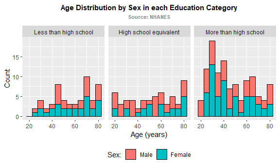

Data Science Homework 3
================
ak5357
2024-10-03

## Problem 2

### ***NHANES Accelerometers***

#### **Load and Tidy the Data**

The following code block imports two .csv datasets with information
about 250 participants from a study by the National Health and Nutrition
Examination Survey (NHANES). The datasets include basic sociodemographic
characteristics (ie. age, sex, education) and accelerometer usage data.
The accelerometer usage data is expressed as Monitor-Independent
Movement Summary, or MIMS.

``` r
# Import demographic (covariate) data
covar_df = read_csv("data/nhanes_covar.csv", skip = 4, trim_ws = TRUE) |> 
  janitor::clean_names() |> 
  filter(age >= 21) |> # exclude participants under 21 years of age
  drop_na() |> # exclude those with missing demographic data
  mutate(
    sex = factor( # convert 'sex' column to factor
      case_when(
        sex == 1 ~ "Male",
        sex == 2 ~ "Female"),
      levels = c("Male", "Female")), # specify order for 'sex'
    education = factor( # convert 'education' column to factor
      case_when(
        education == 1 ~ "Less than high school",
        education == 2 ~ "High school equivalent",
        education == 3 ~ "More than high school"),
      levels = c("Less than high school", "High school equivalent", "More than high school")) # specify order for 'education'
    )

# Import NHANES Accelerometer Data
accel_df = read_csv("data/nhanes_accel.csv") |> 
  janitor::clean_names() |> 
  pivot_longer(
    cols = starts_with("min"),
    names_to = "time",
    values_to = "mims",
    names_prefix = "min"
  ) |> 
  mutate( # change time column datatype to <time>
    #time = hms::hms(as.numeric(time)*60)
    time = as.POSIXct(as.numeric(time) * 60, tz = "UTC")
  ) |> 
  filter( # exclude those with missing demographic data
    seqn %in% pull(covar_df, seqn)
  )
```

#### **Reader-Friendly Table**

The table below shows the number of men and women in each education
category. It looks like there is an even split between men and women in
all categories except “High school equivalent”, where there are
significantly more men than women.

``` r
# CREATE TABLE
tbl_edu_dist_sex =
  covar_df |> 
  count(education, sex) |> 
  pivot_wider(
    names_from = sex,
    values_from = n
  ) |> 
  rename_with(~ tools::toTitleCase(.)) |>
  knitr::kable()

# SHOW TABLE
tbl_edu_dist_sex
```

| Education              | Male | Female |
|:-----------------------|-----:|-------:|
| Less than high school  |   27 |     28 |
| High school equivalent |   35 |     23 |
| More than high school  |   56 |     59 |

#### **Visualizing the Data**

The visualization below depicts the age distributions for men and women
in each education category.

I chose to represent these through a three-facet histogram with stacked
bars and set values for bin width. The multi-facet plot emphasizes that
the age distribution is being compared between education categories.
Stacked bars are less visually overwhelming than dodge-position bars and
help to visualize the proportion of men vs. women in each education/age
category. I set the bin width values to 5 because it’s easy to interpret
for a wider audience. I also made minor aesthetic and formatting changes
to the labels for a more professional-looking output.

``` r
# CREATE HISTOGRAM
ggp_age_dist_edu_sex =
  covar_df |> 
  # Create plot ---------------------
  ggplot(aes(x = age, fill = sex)) +
  geom_histogram(color = "black", binwidth = 5) +
  # Organize plot -------------------
  facet_grid(. ~ education) +
  labs(
    title = "Age Distribution by Sex in each Education Category",
    subtitle = "Source: NHANES",
    x = "Age (years)",
    y = "Count",
    fill = "Sex:"
  )

# SHOW VISUALIZATION
ggp_age_dist_edu_sex
```



#### **Analyzing the Data**

The following scatterplot depicts the participants’ total activity over
the day (24-hour period), calculated as the sum of minute-by-minute MIMS
measurements from the accelerometer. The data is stratified by education
category and sex. The smoothed lines in the plot depict the overall
trend for each education/sex strata.

``` r
# CREATE SCATTERPLOT
ggp_activity_dist_age_edu_sex =
  # Manipulate data -----------------
  accel_df |> 
  group_by(seqn) |> 
  summarize(
    total_activity = sum(mims)
  ) |> 
  full_join(covar_df, "seqn") |> 
  # Create plots --------------------
  ggplot(aes(x = age, y = total_activity, color = sex)) +
  # Create trendline ---------------
  geom_smooth(se = FALSE, size = 0.6) +
  # Create scatterplot --------------
  geom_point() +
  # Organize scatterplot ------------
  facet_grid(. ~ education) +
  labs(
    title = "Total Activity by Age in each Education Category",
    subtitle = "Source: NHANES",
    x = "Age (years)",
    y = "Total Activity",
    color = "Sex:"
  )

# SHOW PLOT
ggp_activity_dist_age_edu_sex
```


**Interpreting the plot:**

Based on the trendlines in the plot above, I believe it is unclear
whether sex has a modifying effect on the relationship between age and
activity. For both the “High school equivalent” and “More than high
school” groups, it appears that the female participants were more active
over the course of the 24-hour study period. However, this pattern does
not extend to the “Less than high school” group.

However, in my optinion, education may have a modifying effect on the
relationship between age and activity. The slope of the trendlines for
both genders decrease in steepness from left to right across the three
graphs. It could be that education level has a greater association with
physical activity for younger participants, as higher education levels
may lead to more sedentary professions.

#### **Average Activity over the Study Period**

The following three-panel plot shows the 24-hour activity time courses
for each education level, with sex indicated by color. Each point on the
plot represents the average MIMS measurement from all participants from
a certain education/sex subgroup. The smooth lines modeled over the
points help visualize the general trend of average activity among the
participants during the 24-hour study period.

For this visual, I chose to depict the average minute-by-minute activity
for each subgroup rather than representing all study participants on the
graph. I felt this would make it easier to visually interpret overall
differences between the subgroups. However, one big limitation is that
this method does not depict variation within the subgroups. If the
variation itself is important to the overall story, then this could be
an issue.

``` r
# CREATE SCATTERPLOT
ggp_time_course =
  # Manipulate data -----------------
  accel_df |> 
  full_join(covar_df, "seqn") |> 
  group_by(time, education, sex) |> 
  summarize(
    average_activity = mean(mims)
  ) |> 
  # Create scatterplot --------------
  ggplot(aes(x = time, y = average_activity, color = sex, fill = sex)) +
  geom_point(shape = 21, aes(fill = sex), color = "white", stroke = 0.5, alpha = 0.5) +
  geom_smooth(aes(color = sex), size = 0.8) + 
  scale_x_datetime(date_labels = "%I %p",  # Format x-axis labels to show hours with AM/PM
                   breaks = scales::date_breaks("6 hour")) +
  # Organize scatterplot ------------
  facet_grid(. ~ education) +
  labs(
    title = "24-Hour Activity Time Course for each Education Category",
    subtitle = "Source: NHANES",
    x = "Time",
    y = "Activity (MIMS by minute)",
    color = "Sex:"
  ) +
  # Aesthetics ----------------------
  scale_color_manual( # slightly darker colors for lines, -10 lum in HSL
    values = c("Female" = "darkcyan", "Male" = "darkred")) +
  guides(fill = "none")

# SHOW PLOT
ggp_time_course
```


**Interpreting the plot:**

***Similarities aross all groups:*** Based on the plot, the
minute-by-minute average activity levels of each education/sex subgroup
of participants are higher during the daytime (around 8AM - 8PM) than
during the night time (around 8PM - 8AM). All subgroups’ average
activity is lowest around 4AM, indicating that the subgroups on average
may be asleep at this time. During the morning, there is a steady
increase in minute-by-minute activity for each subgroup between around
6-11AM and a steady decrease in the slope between around 7PM-12AM.

***Differences between the sexes:*** Across all education groups, it
appears that the average activity among women is slightly higher during
daytime “working hours” (around 9AM-6PM) than the men’s. It is also
interesting that average male energy level in the “More than high
school” group has a noticeable dip at around 4PM.

***Differences between education groups:*** In my opinion, the most
noticeable differences between the education groups are the peak level
of average activity and the slope of the trendline during “working
hours”. I predict that these differences could be attributed to work
environment, which is known to differ by education level. However, this
is just my speculation. More study is needed to draw statistically
significant conclusions or determine causal associations.

## Problem 3

### ***NYC Citibike***

#### **Load and Tidy the Data**

The following code chunk imports all four citibike datasets, merges them
into one dataset, and tidies the data. The resulting dataframe has nine
columns:

- ride_id (character): *unique identifier sequence for each ride*
- bike_type (factor): *classic or electric*
- rider_type (factor): *member or casual*
- start_station_name (character): *where the ride started*
- end_station_name (character): *where the ride ended*
- weekday (factor), month (factor), year (double): *temporal
  information*

``` r
# IMPORT CITIBIKE DATASETS
cb_jan_20_df = read_csv("data/citibike/Jan 2020 Citi.csv") |> 
  mutate(month = "Jan", year = 2020)
cb_jul_20_df = read_csv("data/citibike/July 2020 Citi.csv") |> 
  mutate(month = "July", year = 2020)
cb_jan_24_df = read_csv("data/citibike/Jan 2024 Citi.csv") |> 
  mutate(month = "Jan", year = 2024)
cb_jul_24_df = read_csv("data/citibike/July 2024 Citi.csv") |> 
  mutate(month = "July", year = 2024)

# MERGE TO ONE DF
citibike_df = 
  # Merge the citibike datasets together ------------
  bind_rows(
    cb_jan_20_df,
    cb_jul_20_df,
    cb_jan_24_df,
    cb_jul_24_df
  ) |> 
  # Fix column datatypes ----------------------------
  mutate(
    rideable_type = factor(case_when(
      rideable_type == "classic_bike" ~ "classic",
      rideable_type == "electric_bike" ~ "electric")),
    weekdays = factor(weekdays, levels = c("Monday", "Tuesday", "Wednesday", "Thursday", "Friday", "Saturday", "Sunday")),
    member_casual = factor(member_casual),
    month = factor(month, levels = c("Jan", "July"))
  ) |> 
  # Organize columns --------------------------------
  rename(
    bike_type = rideable_type,
    rider_type = member_casual,
    weekday = weekdays) |> 
  relocate(ride_id, bike_type, rider_type) |> 
  relocate(-c(weekday, month, year))
```

Here’s some more information about the dataframe:

- Rows: 99485
- Columns: 9

#### **Reader-Friendly Table**

The table below shows the number of rides from each timeframe that were
from either casual riders or members. Here are some observations about
the data:

- There were more riders, both casual and member, in 2024 than in 2020.
- In both years, there are more riders in July than in January.
- In every timeframe, there are more member riders than casual riders.

``` r
# CREATE TABLE
tbl_rider_type_by_month = citibike_df |> 
  count(month, year, rider_type) |> 
  pivot_wider(
    names_from = rider_type,
    values_from = n
  ) |> 
  arrange(year, month) |> 
  mutate(timeframe = paste(month, year)) |> 
  relocate(timeframe) |> 
  select(-month, -year) |> 
  rename_with(~ tools::toTitleCase(.)) |>
  knitr::kable()

# SHOW TABLE
tbl_rider_type_by_month
```

| Timeframe | Casual | Member |
|:----------|-------:|-------:|
| Jan 2020  |    984 |  11436 |
| July 2020 |   5637 |  15411 |
| Jan 2024  |   2108 |  16753 |
| July 2024 |  10894 |  36262 |

#### **Most Popular Starting Stations in July 2024**

The table below shows the 5 most popular starting stations for July
2024, along with the number of rides that originated from each of those
stations during that timeframe.

``` r
# CREATE TABLE
tbl_popular_starts = citibike_df |> 
  filter(month == "July", year == 2024) |> 
  count(start_station_name) |> 
  arrange(-n) |> 
  head(5) |> 
  rename(Ride_Count = n, Start_Station_Name = start_station_name) |> 
  knitr::kable()

# SHOW TABLE
tbl_popular_starts
```

| Start_Station_Name       | Ride_Count |
|:-------------------------|-----------:|
| Pier 61 at Chelsea Piers |        163 |
| University Pl & E 14 St  |        155 |
| W 21 St & 6 Ave          |        152 |
| West St & Chambers St    |        150 |
| W 31 St & 7 Ave          |        146 |

#### **Visualizing Median Ride Duration**

The following plot investigates the effects of day of the week, month,
and year on median ride duration.

``` r
# CREATE SCATTERPLOT
ggp_ride_duration =
  # Manipulate data ------------------------
  citibike_df |> 
  mutate(
    year = factor(year, levels = c(2020, 2024)),
    weekday = factor(case_when(
      weekday == "Monday" ~ "M",
      weekday == "Tuesday" ~ "Tu",
      weekday == "Wednesday" ~ "W",
      weekday == "Thursday" ~ "Th",
      weekday == "Friday" ~ "F",
      weekday == "Saturday" ~ "Sa",
      weekday == "Sunday" ~ "Su",
    ), levels = c("M", "Tu", "W", "Th", "F", "Sa", "Su"))
  ) |> 
  group_by(weekday, month, year) |> 
  summarize(
    median_duration = median(duration)
  ) |> 
  # Create scatterplot --------------------
  ggplot(aes(x = weekday, y = median_duration, fill = month)) +
  geom_point(shape = 21, color = "white", size = 3, stroke = 0.5) +
  # Organize plot -------------------------
  facet_grid(. ~ year) +
  labs(
    title = "Median Ride Duration by Weekday, Month, and Year",
    subtitle = "Source: NYC Citibike",
    x = "Weekday",
    y = "Median Duration of Bike Ride (min)",
    fill = "Month:"
  ) +
  # Aesthetics ----------------------------
  scale_fill_manual(values = c("Jan" = "lightblue", "July" = "orange"))

# SHOW PLOT
ggp_ride_duration
```


**Observations:**

***Across both years, median bike durations are higher in July than in
January.*** This could be associated with summer weather being more
pleasant for outdoor activities like bike riding.

***Bike rides for both months appear to be higher in 2020 than in
2024.*** This could be attributed to changes in population behaviors
during the COVID-19 pandemic, where most people sought out outdoor
hobbies that could be enjoyed while social distancing, such as bike
riding.

***Across all month and year combinations, the median duration of rides
is longest on Saturdays and Sundays.*** Weekend days are typically more
leisurely and fun-activity-filled than weekdays, which could allow
Citibike users to enjoy their bike rides for longer or perhaps to go
farther distances.

#### **Visualizing the Riders of 2024**

The following plot explores the impact of month, membership status, and
bike type on the distribution of ride duration

``` r
# FIGURE OPTIONS
fig.asp = 3

# CREATE BOX PLOT
ggp_riders =
  # Manipulate data -----------------------
  citibike_df |> 
  filter(year == 2024) |>
  mutate(
    rider_type = str_to_title(rider_type),
    bike_type = str_to_title(bike_type)
  ) |> 
  group_by(month, rider_type, bike_type) |> 
  # Create scatterplot --------------------
  ggplot(aes(x = month, y = duration, fill = bike_type)) +
  geom_boxplot(color = "black", outlier.size = 0.4, size = 0.2) +
  # Organize plot -------------------------
  facet_grid(. ~ rider_type) +
  labs(
    title = "Distribution of Ride Duration by Month, Membership, and Bike Type",
    subtitle = "Source: NYC Citibike",
    x = "Month",
    y = "Duration of Bike Ride (min)",
    fill = "Bike Type:"
  ) +
  # Aesthetics ----------------------------
  scale_fill_manual(values = c("Classic" = "lightblue", "Electric" = "orange"))

# SHOW PLOT
ggp_riders
```


**Observations:**

***Member riders tend to have shorter ride durations.*** The boxplots
for member riders in both months and across both bike types are shorter
and lower on the plot than those for the casual riders. It could mean
that member riders, who might use Citibike more regularly, are using
them for commutes of up to 30 minutes. In contrast, casual riders may
use them for longer durations.

***All boxplots are positively (right) skewed, with many outliers.***
Across the board, for both bike types in both months, the vast majority
of rides are under under an hour long for Casual riders and under 30
minutes for member riders. It is interesting to see that there are so
many outliers for every single boxplot. This indicates that there is a
very high density of data represented by the boxplots themselves.

***Differences in classic vs. electric bike ride durations appear to
vary by membership type.*** For casual riders, it appears that electric
bikes are associated with shorter ride durations, since the electric
bike boxplots are lower than the classic bike boxplots on the graph.
However, for Member riders, there does not appear to be a significant
difference in ride duration associated with bike type.
